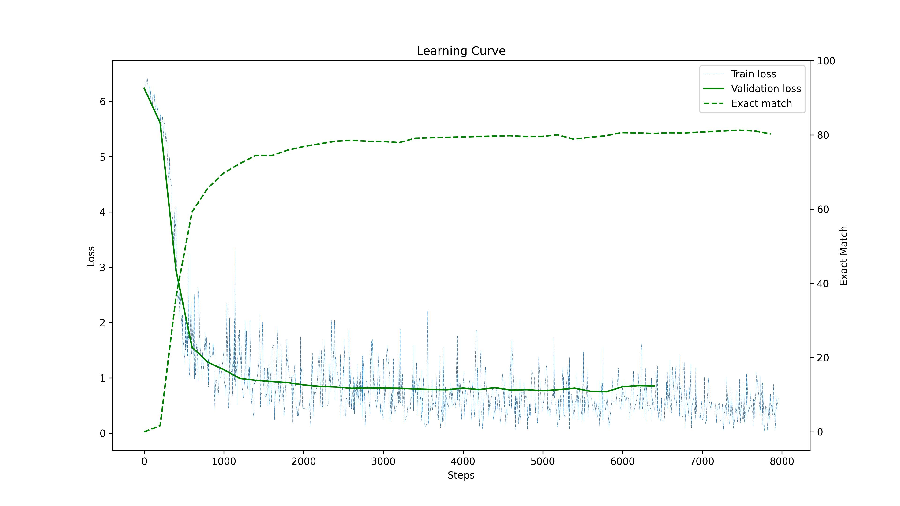
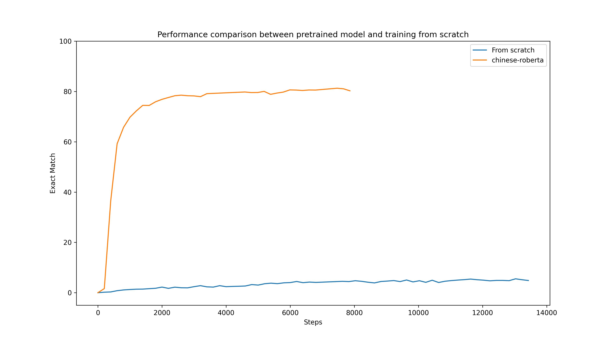

# Report

Student ID: R11922001

## Q1: Data Preprocessing

### Tokenizer

According to the [document](https://huggingface.co/docs/transformers/v4.24.0/en/model_doc/bert#transformers.BertTokenizer), Huggingface implements WordPiece as default tokenizer for BERT. [WordPiece](https://static.googleusercontent.com/media/research.google.com/en//pubs/archive/37842.pdf) is a commonly used techniques to segment words into sub-words.

1. It first initialize the word unit inventory with the basic characters (single word in Chinese)
2. Build a language model on the training data using the inventory from 1.
3. Generate a new word unit by combining two units out of the current word inventory to increment the word unit inventory by one. Choose the new word unit out of all possible ones that increases the likelihood on the training data the most when added to the model.
4. Repeat 2 and 3 until vocab size meets stop criteria
   - Predefined limit of word units, or
   - The likelihood increase falls below a certain threshold.

### Answer Span

According to the [document](https://huggingface.co/docs/transformers/v4.24.0/en/main_classes/tokenizer#transformers.PreTrainedTokenizer.__call__), `BertTokenizer` returns the mapping between position-on-characters and position-on-token when tokenizing the input sentences.
Because we are using sub-word tokenizer in this task, one letter might maps to single or multiple tokens.

I keep using the post-process function `postprocess_qa_predictions()` which is provided in Huggingface's example. After model predicts the probability of answer span start/end position, the candidates are post-processed. The steps are describe as following.

1. Convert the predictions from position-to-tokens to position-to-characters, concatenate sentences if it is truncated before feeding to model.
2. Filter combinations of start/end logits which does not make scene, keeps the combinations if start index is smaller than the end index.
3. Calculate the score (score = score of start logits + score of end logits). Then, sort combinations by score with descending order.
4. Return k-best predictions (k=1 here).

Reference:
- [Medium - Question-Answering in association with RoBERTa](https://medium.com/mlearning-ai/question-answering-in-association-with-roberta-a11518e70507)
- [Hugging Face 的 Transformers 库快速入门（五）：快速分词器](https://xiaosheng.run/2022/03/08/transformers-note-5.html#1-%E5%BF%AB%E9%80%9F%E5%88%86%E8%AF%8D%E5%99%A8)

---

## Q2: Modeling with BERTs and their variants

- Public score (2 highest submissions): 79.475% / 77.124%

- Multiple choice:
  - Pretrained transformer: bert-base-chinese
  - Model configuration:
    - attention_probs_dropout_prob: 0.1,
    - classifier_dropout: null,
    - directionality: bi-directional,
    - hidden_act: gelu,
    - hidden_dropout_prob: 0.1,
    - hidden_size: 768,
    - initializer_range: 0.02,
    - intermediate_size: 3072,
    - layer_norm_eps: 1e-12,
    - max_position_embeddings: 512,
    - model_type: bert,
    - num_attention_heads: 12,
    - num_hidden_layers: 12,
    - pad_token_id: 0,
    - pooler_fc_size: 768,
    - pooler_num_attention_heads: 12,
    - pooler_num_fc_layers: 3,
    - pooler_size_per_head: 128,
    - pooler_type: first_token_transform,
    - position_embedding_type: absolute,
    - torch_dtype: float32,
    - transformers_version: 4.22.2,
    - type_vocab_size: 2,
    - use_cache: true,
    - vocab_size: 21128
  - Loss function: Loss function: CrossEntropy (Selecting one of the option from given context)
  - Batch size and optimizer:
    - `Adam(lr=3e-5, weight_decay=0)`
    - Max epoch: 1
    - Batch size: 2
    - Gradient accumulation steps: 4
  - Model accuracy: 95.78%

- Question Answering:
  - Pretrained transformer: hfl/chinese-roberta-wwm-ext
  - Model configuration:
    - attention_probs_dropout_prob: 0.1,
    - bos_token_id: 0,
    - classifier_dropout: null,
    - directionality: bi-directional,
    - eos_token_id: 2,
    - hidden_act: gelu,
    - hidden_dropout_prob: 0.1,
    - hidden_size: 768,
    - initializer_range: 0.02,
    - intermediate_size: 3072,
    - layer_norm_eps: 1e-12,
    - max_position_embeddings: 512,
    - model_type: bert,
    - num_attention_heads: 12,
    - num_hidden_layers: 12,
    - output_past: true,
    - pad_token_id: 0,
    - pooler_fc_size: 768,
    - pooler_num_attention_heads: 12,
    - pooler_num_fc_layers: 3,
    - pooler_size_per_head: 128,
    - pooler_type: first_token_transform,
    - position_embedding_type: absolute,
    - torch_dtype: float32,
    - transformers_version: 4.22.2,
    - type_vocab_size: 2,
    - use_cache: true,
    - vocab_size: 21128
  - Loss function: CrossEntropy() (Selecting start index and end index of the answer span)
  - Batch size and optimizer:
    - `Adam(lr=3e-5, weight_decay=0)`
    - Max epoch: 15
    - Batch size: 8
    - Gradient accumulation steps: 8
  - Model accuracy: 81.62%

I tried using `hfl/chinese-xlnet-base` as my pretrained mode, but it does not beat the model pre-trained by RoBERTa.

- Question Answering:
  - Pretrained transformer: hfl/chinese-xlnet-base
  - Model configuration:
    - attn_type: bi,
    - bi_data: false,
    - bos_token_id: 1,
    - clamp_len: -1,
    - d_head: 64,
    - d_inner: 3072,
    - d_model: 768,
    - dropout: 0.1,
    - end_n_top: 5,
    - eos_token_id: 2,
    - ff_activation: relu,
    - initializer_range: 0.02,
    - layer_norm_eps: 1e-12,
    - mem_len: null,
    - model_type: xlnet,
    - n_head: 12,
    - n_layer: 12,
    - output_past: true,
    - pad_token_id: 5,
    - reuse_len: null,
    - same_length: false,
    - start_n_top: 5,
    - summary_activation: tanh,
    - summary_last_dropout: 0.1,
    - summary_type: last,
    - summary_use_proj: true,
    - torch_dtype: float32,
    - transformers_version: 4.22.2,
    - untie_r: true,
    - use_mems_eval: true,
    - use_mems_train: false,
    - vocab_size: 32000
  - Loss function: CrossEntropy()
  - Batch size and optimizer:
    - `Adam(lr=3e-5, weight_decay=0)`
    - Max epoch: 10
    - Batch size: 8
    - Gradient accumulation steps: 8
  - Model accuracy: 75.21%

---

## Q3: Learning curves of QA model

---

## Q4: Pretrained v.s. Not Pretrained

I train the BERT from scratch, and the performance is really poor. It achieves only 5.51% accuracy on task of question answering given double training steps. The model configuration is the same as model reported in Q2, GPU memory is not enough, I have cut the batch size as half and doubled the gradient accumulation steps, thus the effective batch size does not changed.

---

## Q5: Bonus: HW1 with BERTs
