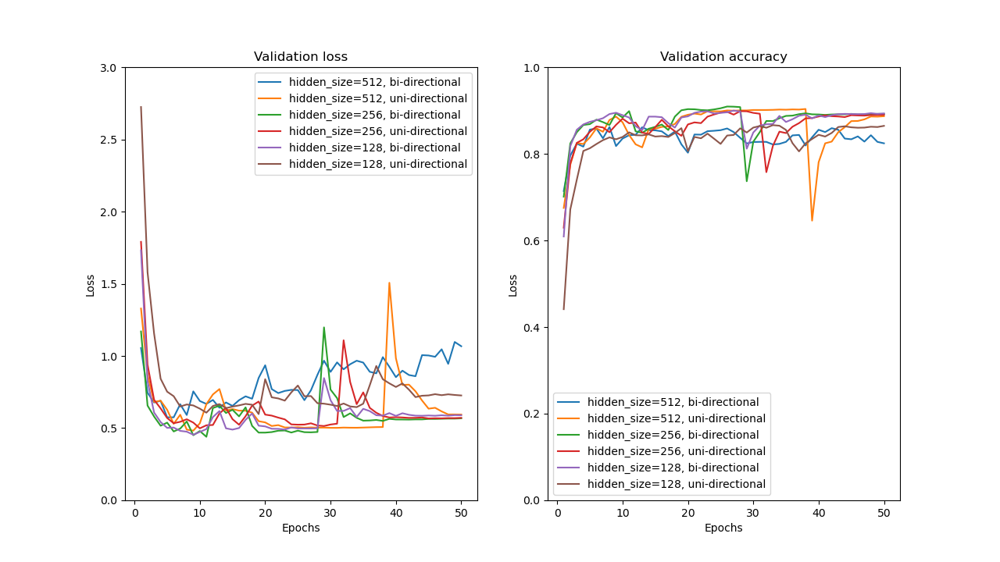

# Report

Student ID: R11922001

## Preprocessing

I use the preprocess script provided in sample code. The details of preprocessing scripts are mentioned below:
- It collects all output labeled in training set and validation set, assign unique ID to them and store in a JSON file.
  - See the key-value pairs in `intent2idx.json` and `tag2idx.json`.
- Then, it counts the frequency of words appeared in input sentences, picks the 10000 most frequently used words, assign unique ID also and saves as key-value pairs (e.g. "run" -> 147).
  - See `Vocab.token2idx`.
- Then, queries the word embedding of frequenly used words in Glove and store key-value pairs into `embeddings.pt` (e.g. 147 -> [0.3000 0.2544 0.7684]). Assign random vector for the words not in pretrained word embedding.
  - See `torch.nn.Embedding` and `SeqClassifier.embed`.
- When a sentence is fed into the model, it's first split to words by space, mapping to tokens by table look-up (`Vocab.pkl`), then mapping to tensor by table look-up (`embeddings.pt`) again.
- Notes:
  - For the words not seen in test phase, a predefined token `UNK` is assigned.
  - To pad the sentences, a predefined token `PAD` is assigned.
  - Both `PAD` and `UNK` have an embedding! They are defined in preprocessing phase.

Statistics (Token covered):
- Applied word embedding: `glove.840B.300d.txt`
- (Max) Vocab size: 10000
  - Intent Classification: 5435 / 6491 = 83.73%
  - Slot Taggin: 3000 / 4147 = 72.34%

---

<div style='page-break-after:always'></div>

## Intent Classification Model

- Model Description:
  - Feature extractor: ElmanRNN
    - $o_t, h_t = \mathrm{RNN}(w_t, h_{t-1})$, where $w_t$ is the word embedding of t-th token.
    - Feed the output of last token ($\tanh{o_T}$) into classifier.
  - Classifier: Single Fully Connected Layer
    - $y = o_TA^T + b$
    - Return $\mathrm{idx} = \argmax_i y_i$ as the result of classification.
- Public score: 0.90088
- Model Training Information:
  - Model size:
    - Hidden size: 512
    - Number of RNN layers: 3
    - Bidirectional: True
    - FC Layers: 1
  - Loss function: CrossEntropy
  - Optimizer:
    - Adam(lr=1e-3, weight_decay=1e-4)
    - Max epoch: 100
    - Keep model parameter with the highest validation accuracy
  - Batch size: 2048
  - Dropout: 0.1

---

<div style='page-break-after:always'></div>

## Slot Tagging Model

- Model Description:
  - Feature extractor: ElmanRNN
    - $o_t, h_t = \mathrm{RNN}(w_t, h_{t-1})$, where $w_t$ is the word embedding of t-th token.
    - Feed the output of each tokens ($O = \{o_1, o_2, ...o_T\}$) into classifier to obtain tags.
  - Classifier: Single Fully Connected Layer
    - $y_t = o_tA^T + b$
    - Return $\mathrm{idx} = \argmax_i y_i$ as the result of classification.
- Public score: 0.79356
- Model Training Information:
  - Model size:
    - Hidden size: 512
    - Number of RNN layers: 3
    - Bidirectional: True
    - FC Layers: 1
  - Loss function: FocalLoss(alpha=0.25, gamma=10)
  - Optimizer:
    - Adam(lr=1e-3, weight_decay=1e-4)
    - Max epoch: 100
    - Keep model parameter with the highest validation accuracy
  - Batch size: 512
  - Dropout: 0.1

---

<div style='page-break-after:always'></div>

## Sequence Tagging Evaluation

Evaluation report:

```
Classification report:
              precision    recall  f1-score   support

        date       0.76      0.75      0.76       209
  first_name       0.89      0.94      0.91        97
   last_name       0.78      0.90      0.84        68
      people       0.71      0.71      0.71       241
        time       0.78      0.82      0.80       209

   micro avg       0.77      0.79      0.78       824
   macro avg       0.79      0.82      0.80       824
weighted avg       0.77      0.79      0.78       824
```

For example, the report shows that my pre-trained model has precision = 0.78, recall = 0.90, f1-score = 0.84 and support = 68 on class "last_name". That means:
- 78% tokens are correctly classified as "last_name" in test cases with class "last_name".
- 90% tokens in class "last_name" are detected from all test cases.
- Using a single performance score (Considered both precision and recall. f1-score, which is the harmonic mean of precision and recall, is proposed here) 0.84 to conclude the model performance on the class "last_name".

There are multiple ways to average the performance on difference classes, 'mirco' (precision and recall are weighted by number of cases), 'macro' (precision and recall for each classes are NOT weighted) and 'weighted' (self-defined weight for difference classes, not specified here).

For the metric 'accuracy', it represents the ratio of cases where the model can be inferenced correctly. Token accuracy counts the number of tokens correctly classified w.r.t all tokens in dataset. Joint accuracy counts the number of sentences correctly tagged, only when the tags for a sentence are all correct.

Reference:
- [seqeval document](https://github.com/chakki-works/seqeval/blob/master/seqeval/metrics/sequence_labeling.py#L41).
- [F-score](https://en.wikipedia.org/wiki/F-score)

---

<div style='page-break-after:always'></div>

## Compare With Different Configuration

**Intent classification model - Best model accuracy in DEV set**

| Hidden Size | w/o Bidirectional | w/ Bidirectional |
| :---------: | :---------------: | :--------------: |
|     512     |      0.9040       |      0.8623      |
|     256     |      0.8990       |      0.9097      |
|     128     |      0.8623       |      0.8987      |

**Model metrics v.s. Epochs**



**Observation**

1. Too many parameters in model produces overfitting issues.
2. The training loss and validation loss increase suddently and slowly decreased again, I suspect that is caused by some numerical instability issues.
